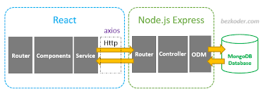

# MERN application core Architecture

**M** -> Mongodb  
**E** -> Express.js  
**R** -> React.js  
**N** -> Node.js  

It is also common to use Mongoose, which is a simple, schema-based solution to model application data.

React is combined with a javascript backend, making it an MVC application.

